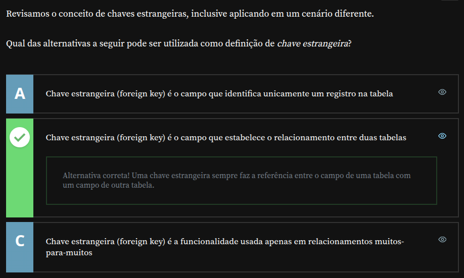

# Alura - PostgreSQL: Views, Sub-Consultas e Funções

## Neste Capítulo

- [Introdução](#introdução)
- [Projeto inicial do treinamento](#projeto-inicial-do-treinamento)
- [Introdução ao Banco de Dados](#introdução-ao-banco-de-dados)
  - [Explorando o PostgreSQL no pgAdmin](#explorando-o-postgresql-no-pgadmin)
  - [O que é uma chave primária?](#o-que-é-uma-chave-primária)
  - [Criando Identificadores na Tabela](#criando-identificadores-na-tabela)
  - [Relacionamento Entre Tabelas](#relacionamento-entre-tabelas)
- [Chaves Estrangeiras](#chaves-estrangeiras)
  - [Entendendo as Chaves Estrangeiras](#entendendo-as-chaves-estrangeiras)
  - [Evoluindo o Banco de Dados](#evoluindo-o-banco-de-dados)
  - [Solução: Criar uma Tabela de Categorias](#solução-criar-uma-tabela-de-categorias)
  - [Atualizando o Banco de Dados](#atualizando-o-banco-de-dados)
  - [Desafio](#desafio)
  - [Testando conhecimento adquirido - Definição formal](#testando-conhecimento-adquirido---definição-formal)

---

## **Introdução**

Nesta etapa, revisaremos conceitos essenciais, como **chaves primárias, chaves estrangeiras e a cláusula UNIQUE**, explorando como ela pode ser utilizada por chaves estrangeiras. Também veremos **diferenças de sintaxe**, principalmente nas chaves estrangeiras, além de um **exemplo prático de chave primária composta**.  

A partir desses estudos, avançaremos até aprender **novas formas de inserção de dados**, incluindo como **preencher múltiplas linhas com uma única instrução** e como **inserir valores sem precisar informar os nomes dos campos**. Todo esse conhecimento nos preparará para **criação de relatórios**, que serão desenvolvidos passo a passo, permitindo que você acompanhe todo o processo real de geração de relatórios.  

Durante esse avanço, exploraremos **novos operadores, como o IN**, além de aprender como **realizar consultas dentro de outras consultas**, dando nome a essas consultas para facilitar sua interpretação.  

Além disso, vamos mergulhar em funções do Postgres para manipulação de **strings, datas, números, conversões de formatos e muito mais**.  

---

## **Projeto inicial do treinamento**

Aqui são fornecidos os arquivos para o projeto inicial deste treinamento, necessário para a continuidade do mesmo.

- [banco-inicial.sql](./src/banco-inicial.sql)

---

## **Introdução ao Banco de Dados**  

Vamos começar com uma rápida revisão do que aprendemos no curso anterior. Primeiro, compreendemos o que é um banco de dados: um espaço onde armazenamos informações bem definidas. No caso de um banco de dados relacional, como o PostgreSQL, ele funciona de maneira semelhante a uma planilha.  

Em uma planilha, temos colunas que definem os tipos de informações a serem inseridas e linhas que representam os dados individuais, como no exemplo:  

| primeiro_nome | ultimo_nome | data_nascimento |
|--------------|------------|----------------|
| Vinicius    | Dias       | 1997-10-15     |
| Maria       | Rosa       | 1997-01-01     |

Cada linha representa um **registro** de informações. O banco de dados relacional segue esse mesmo princípio, mas com uma diferença fundamental: ele não se limita a uma única tabela. Em vez disso, pode conter múltiplas tabelas, como diferentes planilhas dentro de um mesmo arquivo.  

Por exemplo, se tivermos uma aba chamada "Página 2" em nossa planilha, encontraremos outra tabela com informações diferentes, como os cursos cadastrados:  

| nome |
|------|
| HTML |
| JS   |
| CSS  |

Assim, de forma simplificada, é organizado um banco de dados.  

### **Explorando o PostgreSQL no pgAdmin**  

Ao acessar o **pgAdmin**, vemos que o servidor gerenciado pelo PostgreSQL contém um banco de dados chamado **"alura"**. Esse banco funciona como um arquivo de planilha, e dentro dele há uma tabela chamada **"aluno"**, que contém um campo **"id"**, nossa chave primária.  

#### **O que é uma chave primária?**  

A chave primária é um identificador único para os registros de uma tabela. Com ela, o banco de dados pode diferenciar um aluno específico dos demais.  

Além do campo **"id"**, a tabela **"aluno"** possui outros atributos:  

- **"primeiro_nome"** – tipo **VARCHAR**, representando um texto que não pode ser nulo (**NOT NULL**)  
- **"ultimo_nome"** – também **VARCHAR** e **NOT NULL**  
- **"data_nascimento"** – tipo **DATE**, que obviamente não pode ser nulo  

Já a tabela **"curso"** funciona como outra aba do mesmo arquivo de planilha. Ela contém:  

- **"id"** – identificador único para cada curso (**PRIMARY KEY**)  
- **"nome"** – nome do curso, que também deve ser preenchido (**NOT NULL**)  

Vale destacar que **todo campo definido como chave primária já é automaticamente NOT NULL**, ou seja, ele não pode conter valores nulos.

#### **Criando Identificadores na Tabela**  

Podemos definir a chave primária de diferentes formas. No caso do **id**, utilizamos **SERIAL PRIMARY KEY**, onde **SERIAL** faz com que os números sejam automaticamente incrementados. Outra possibilidade seria usar **CPF CHAR(11) PRIMARY KEY**. Nesse caso, ao invés de o banco gerar automaticamente um identificador, precisaríamos informar manualmente cada CPF, mas a estrutura seguiria funcionando normalmente.  

### **Relacionamento Entre Tabelas**  

Depois de definir as tabelas **"aluno"** e **"curso"**, criamos uma **tabela de relacionamento**. Essa tabela indica que um aluno está matriculado em um curso.  

- Um curso pode ter **vários alunos**  
- Um aluno pode estar **matriculado em vários cursos**  

Para garantir que um mesmo aluno **não seja cadastrado duas vezes no mesmo curso**, utilizamos uma **chave primária composta**. Isso significa que o identificador único desse relacionamento é a combinação de duas colunas: o ID do aluno e o ID do curso.  

Dessa forma, **não podemos repetir a matrícula do mesmo aluno para o mesmo curso**. Assim, as duas colunas formam um identificador único, garantindo integridade nos dados.  

Agora que revisamos esses conceitos, **vamos incrementar nosso banco de dados!**  

---

## **Chaves Estrangeiras**  

Vamos revisar o conceito de **chaves estrangeiras**, reforçando pontos importantes e explorando novas aplicações.  

### **Entendendo as Chaves Estrangeiras**  

Uma chave estrangeira estabelece **um vínculo entre tabelas**, garantindo a **integridade dos dados** ao impedir que registros sejam inseridos sem uma referência válida.  

Por exemplo, a tabela **"aluno_curso"** é responsável por armazenar a relação entre alunos e cursos. Sempre que um novo aluno for matriculado, precisamos garantir que ele **já exista na tabela "aluno"**, e o mesmo vale para os cursos cadastrados.  

No treinamento anterior, aprendemos a definir chaves estrangeiras de duas formas:  

1. **Usando a sintaxe explícita**

   ```sql
   FOREIGN KEY (nome_do_campo) REFERENCES nome_da_tabela(nome_do_campo_na_tabela)
   ```  

   Isso cria uma restrição para assegurar que o valor inserido em um campo seja válido dentro da tabela referenciada.  

2. **Definindo diretamente na criação do campo**  

   ```sql
   aluno_id INTEGER NOT NULL REFERENCES aluno(id)
   ```  

   Aqui, garantimos que **"aluno_id"** será um número inteiro **não nulo** e que **deve existir na tabela "aluno"**, referenciando seu campo "id".  

Com essa configuração, **não conseguimos inserir um aluno_id que não exista previamente na tabela "aluno"**, garantindo a consistência dos dados. O mesmo princípio se aplica ao **curso_id**, que deve referenciar um curso válido.  

---

### **Evoluindo o Banco de Dados**  

Agora, precisamos organizar nossos cursos em **categorias**. A primeira ideia seria adicionar um campo `categoria VARCHAR(255) NOT NULL` à tabela "curso". Isso nos permitiria definir manualmente a categoria de cada curso.  

Entretanto, essa abordagem pode causar problemas, como:  

- **Consumo desnecessário de espaço**, já que o mesmo nome de categoria pode se repetir várias vezes.  
- **Inconsistência nos dados**, devido a variações na digitação, como "Front-End", "front end", "programaçao", "programacão", etc.  

### **Solução: Criar uma Tabela de Categorias**  

Para evitar inconsistências, vamos criar uma tabela separada para armazenar as categorias:  

```sql
CREATE TABLE categoria (
    id SERIAL PRIMARY KEY,
    nome VARCHAR(255) NOT NULL
);
```  

Aqui, **cada categoria será identificada por um ID único**. Dessa forma, em vez de repetir o nome da categoria na tabela "curso", apenas referenciamos o ID correspondente.  

Agora podemos relacionar a tabela **"categoria"** com **"curso"**, garantindo que cada curso pertença a uma categoria válida:  

```sql
CREATE TABLE curso (
    id SERIAL PRIMARY KEY, 
    nome VARCHAR(255) NOT NULL, 
    categoria_id INTEGER NOT NULL REFERENCES categoria(id)
);
```  

Com essa abordagem:  

✅ **Reduzimos o espaço ocupado** (substituindo texto por um identificador numérico).  
✅ **Evitamos erros de digitação** ao utilizar chaves estrangeiras.  
✅ **Mantemos a estrutura do banco de dados mais organizada e eficiente**.  

### **Atualizando o Banco de Dados**  

Para implementar essa melhoria, **precisamos excluir a tabela "curso" existente** e recriá-la com a chave estrangeira `categoria_id`.  

Entretanto, o banco de dados impede a exclusão da tabela "curso" porque **outras tabelas dependem dela** como "aluno_curso".  

Para resolver esse impasse, **primeiro excluímos "aluno_curso", depois "curso"**:  

```sql
DROP TABLE aluno_curso, curso;
```  

Agora podemos recriar a tabela "curso" com a nova estrutura e estabelecer a chave estrangeira corretamente.  

---

### **Desafio**  

Agora que configuramos nossa tabela de categorias, o desafio é **popular o banco de dados** com:  

- **Alunos**  
- **Categorias**  
- **Cursos**  
- **Matrículas dos alunos nos cursos**  

Além disso, podemos reorganizar o código SQL movendo a criação da tabela **"categoria"** para antes da tabela "curso", pois **um curso precisa de uma categoria antes de ser criado**.  

Na próxima etapa do treinamento, vamos aprofundar nosso entendimento sobre **tipos de relacionamentos**.  

---

### **Resolução do Desafio**

Para realização do desafio, criei e executei o script abaixo:

- [populando-banco-dados.sql](./src/populando-banco-dados.sql)

---

### **Testando conhecimento adquirido - Definição formal**

Revisamos o conceito de chaves estrangeiras, inclusive aplicando em um cenário diferente.

Qual das alternativas a seguir pode ser utilizada como definição de _**chave estrangeira?**_



---

## **Tipos de Relacionamentos em Banco de Dados**  

Já exploramos **chaves primárias** e **chaves estrangeiras**, mas há um detalhe importante: **sempre que criamos uma chave estrangeira, ela deve referenciar um campo único**.  

Por exemplo, se tentássemos referenciar o campo `"nome"` da tabela `"categoria"` como chave estrangeira, isso não funcionaria. Afinal, nossa tabela pode conter **múltiplos registros com o mesmo nome de categoria**, como `"Programação"`, o que tornaria a referência inválida.  

Entretanto, se **modificarmos esse campo** para `nome VARCHAR(255) NOT NULL UNIQUE`, garantindo que cada nome seja único, poderíamos referenciá-lo como uma chave estrangeira.  

Apesar dessa possibilidade, a prática mais comum (e recomendada) é que chaves estrangeiras **referenciem chaves primárias**. Isso garante que a referência seja a um **identificador único**, ou seja, um dado que o banco já trata como um identificador exclusivo daquela tabela.

---

### **O que é Cardinalidade?**  

Quando falamos de **tipos de relacionamentos**, estamos tratando de um conceito chamado **cardinalidade**. Esse estudo analisa como as tabelas se relacionam entre si e define **quantos registros de uma tabela podem se associar a outra**.  

Vamos analisar alguns casos práticos.

---

### **Relacionamento 1:N (Um para Muitos) e N:1 (Muitos para Um)**  

A tabela `"categoria"` e a tabela `"curso"` possuem um **relacionamento 1:N**. Isso significa que:  

- **Uma categoria pode estar associada a muitos cursos**  
- **Cada curso pertence a apenas uma categoria**  

Ou seja, um único registro na tabela `"categoria"` pode estar presente em **diversos cursos**, mas cada curso pode ter **apenas uma categoria**. Esse tipo de relacionamento **não exige uma tabela auxiliar**, pois pode ser estabelecido diretamente entre as tabelas principais usando uma chave estrangeira.

---

### **Relacionamento N:N (Muitos para Muitos)**  

No caso de **alunos e cursos**, o relacionamento é **N:N (muitos para muitos)**. Isso significa que:  

- **Um mesmo aluno pode se matricular em vários cursos**  
- **Um mesmo curso pode ter vários alunos**  

Sempre que um relacionamento for **muitos para muitos**, é necessário **criar uma tabela de junção** nesse caso, a tabela `"aluno_curso"`.  

Essa tabela **não representa uma entidade isolada**, mas sim **a relação entre cursos e alunos**.

---

### **Relacionamento 1:1 (Um para Um)**  

Esse é um tipo de relacionamento **menos comum**, mas útil para a organização do banco de dados.  

Por exemplo, suponha que cada aluno tenha um **único endereço**. Podemos armazenar as informações de endereço diretamente na tabela `"aluno"`, adicionando campos como `"rua"`, `"bairro"`, `"cidade"` e `"número"`.  

Alternativamente, podemos criar uma **tabela separada** chamada `"endereco"`, contendo:  

| id  | rua       | bairro    | cidade  | estado | cep        | número |
|----|----------|----------|--------|--------|----------|--------|
| 1  | Rua X     | Centro    | SP      | SP     | 01000-000 | 100    |

Em `"aluno"`, teríamos apenas um campo **"endereco_id"** que referencia essa tabela. Como cada aluno tem **apenas um endereço**, e cada endereço pertence a **apenas um aluno**, esse seria um exemplo de **relacionamento 1:1**.  

O **relacionamento 1:1 é útil quando temos informações extensas** que podem ser organizadas de forma mais eficiente ao separá-las em tabelas diferentes.

---

### **Resumo dos Tipos de Relacionamento**  

| Tipo de Relacionamento | Exemplo |
|----------------|---------|
| **1:N** (um para muitos) | Categoria → Curso |
| **N:N** (muitos para muitos) | Aluno ↔ Curso (necessário tabela de junção) |
| **1:1** (um para um) | Aluno ↔ Endereço |

Essa compreensão nos permite estruturar um banco de dados de forma **mais eficiente e organizada**.  

---

### **Integridade Referencial**

A **integridade referencial** é um dos pilares essenciais na modelagem de bancos de dados relacionais. Ao garantir que as chaves estrangeiras sempre referenciem registros válidos em tabelas relacionadas, evitamos erros e inconsistências nos dados. Aqui estão os principais benefícios:

🔹 **Consistência dos dados** – Impede que registros fiquem órfãos, ou seja, evita que uma tabela faça referência a dados que não existem mais na tabela principal.

🔹 **Prevenção de erros** – Se um aluno está matriculado em um curso, mas esse curso for excluído sem um controle de integridade, o banco de dados poderia ficar inconsistente. Com a integridade referencial, esse tipo de erro é evitado.

🔹 **Facilidade na manutenção** – Garante que alterações nos dados sejam feitas de maneira segura. Por exemplo, se um curso precisa ser atualizado, todas as tabelas relacionadas continuarão corretas sem impactos negativos.

🔹 **Otimização das consultas** – Um banco de dados bem estruturado e consistente permite consultas mais rápidas e eficientes, já que a lógica de relacionamento entre os dados está clara e bem definida.

🔹 **Evita duplicação de dados** – Como as tabelas estão corretamente relacionadas, reduz-se a necessidade de armazenar informações repetidas, contribuindo para uma estrutura mais enxuta e organizada.

🔹 **Melhora a integridade transacional** – Em operações que envolvem múltiplas tabelas, a integridade referencial garante que todas as partes de uma transação sejam concluídas corretamente, evitando problemas com informações incompletas.

Esses benefícios tornam a integridade referencial uma prática fundamental em qualquer banco de dados relacional. No seu treinamento, ao configurar corretamente os relacionamentos, você estará garantindo um sistema mais seguro, confiável e eficiente!

No próximo capítulo, vamos colocar em prática tudo o que aprendemos: **manipular bancos de dados, criar relatórios e muito mais!** 🚀  

---
